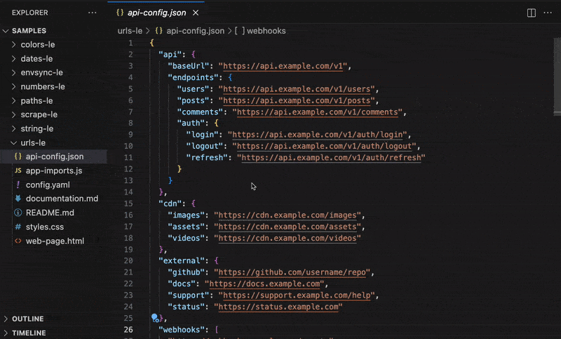
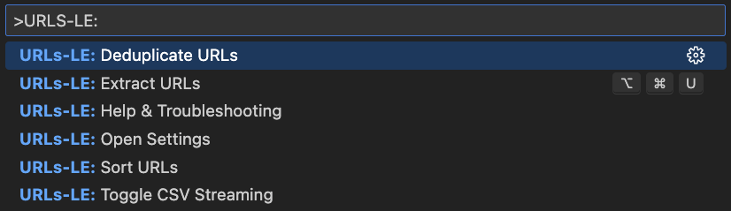

<p align="center">
  
</p>
<h1 align="center">URLs-LE: Zero Hassle URL Extraction</h1>
<p align="center">
  <b>Instantly extract URLs from your codebase with precision</b><br/>
  <i>HTML, CSS, JavaScript, JSON, YAML, XML, TOML, INI, Properties, Markdown, and more</i>
</p>

<p align="center">
  <!-- VS Code Marketplace -->
  <a href="https://marketplace.visualstudio.com/items?itemName=nolindnaidoo.urls-le">
    
  </a>
  <!-- Open VSX -->
  <a href="https://open-vsx.org/extension/nolindnaidoo/urls-le">
    
  </a>
  <!-- Build -->
  <a href="https://github.com/nolindnaidoo/urls-le/actions">
    
  </a>
  <!-- License -->
  <a href="https://github.com/nolindnaidoo/urls-le/blob/main/LICENSE">
    
  </a>
</p>

<p align="center">
  <i>Tested on <b>Ubuntu</b>, <b>macOS</b>, and <b>Windows</b> for maximum compatibility.</i>
</p>

---

<p align="center">
  
</p>

<p align="center">
  
</p>

## 🙏 Thank You!

Thank you for your interest in URLs-LE! If this extension has been helpful in managing your URL extraction needs, please consider leaving a rating on [VS Code Marketplace](https://marketplace.visualstudio.com/items?itemName=nolindnaidoo.urls-le) and [Open VSX](https://open-vsx.org/extension/nolindnaidoo/urls-le). Your feedback helps other developers discover this tool and motivates continued development.

⭐ **Star this repository** to get notified about updates and new features!

## ✅ Why URLs-LE

**Modern web applications use URLs everywhere** — API endpoints, asset links, external resources, and navigation paths. Keeping track of all URL references across your codebase can be complex.

**URLs-LE makes URL extraction effortless.**  
It intelligently detects and extracts URLs from your code, helping you manage web resources effectively.

- **Web development audit without the hassle**  
  Instantly extract and analyze URLs from any web project. Get comprehensive insights into API endpoints, asset references, and external links.

- **Validation across configs & APIs**  
  Surface every URL reference for validation, link checking, and resource management verification.

- **Confident edits in complex projects**  
  Flatten nested URLs into a simple list you can safely analyze without breaking structure or formatting.

- **Stream massive datasets**  
  Work with large numbers of URLs without locking up VS Code. Process large documentation and configuration files efficiently.

- **Automatic cleanup built-in**
  - **Sort** for stable analysis and reviews
  - **Dedupe** to eliminate noise
  - **Filter** by protocol or domain
- **Fast at any scale**  
  Benchmarked for 10,000+ URLs per second, URLs-LE keeps up with large web projects and enterprise monorepos without slowing you down.

## 🚀 More from the LE Family

**URLs-LE** is part of a growing family of developer tools designed to make your workflow effortless:

- **Strings-LE** - Extract every user-visible string from JSON, YAML, CSV, TOML, INI, and .env files with zero hassle  
  [[VS Code Marketplace](https://marketplace.visualstudio.com/items?itemName=nolindnaidoo.string-le)] [[Open VSX](https://open-vsx.org/extension/nolindnaidoo/string-le)]

- **EnvSync-LE** - Effortlessly detect, compare, and synchronize .env files across your workspace with visual diffs  
  [[VS Code Marketplace](https://marketplace.visualstudio.com/items?itemName=nolindnaidoo.envsync-le)] [[Open VSX](https://open-vsx.org/extension/nolindnaidoo/envsync-le)]

- **Numbers-LE** - Extract and analyze numeric data from JSON, YAML, CSV, TOML, INI, and .env  
  [[VS Code Marketplace](https://marketplace.visualstudio.com/items?itemName=nolindnaidoo.numbers-le)] [[Open VSX](https://open-vsx.org/extension/nolindnaidoo/numbers-le)]

- **Paths-LE** - Extract and analyze file paths from imports, configs, and dependencies  
  [[VS Code Marketplace](https://marketplace.visualstudio.com/items?itemName=nolindnaidoo.paths-le)] [[Open VSX](https://open-vsx.org/extension/nolindnaidoo/paths-le)]

- **Scrape-LE** - Verify page reachability and detect anti-scraping measures before deploying scrapers  
  [[VS Code Marketplace](https://marketplace.visualstudio.com/items?itemName=nolindnaidoo.scrape-le)]

Each tool follows the same philosophy: **Zero Hassle, Maximum Productivity**.

## 💡 Use Cases & Examples

### Web Development Audit

Extract all URLs in a web application:

```html
<!-- Extract from index.html -->
<a href="https://example.com">Visit our site</a>

<link rel="stylesheet" href="https://fonts.googleapis.com/css?family=Roboto" />
```

### API Documentation Analysis

Extract API endpoints from documentation:

```markdown
<!-- Extract from api-docs.md -->

## Endpoints

- GET https://api.example.com/users
- POST https://api.example.com/users
- PUT https://api.example.com/users/{id}
```

### Configuration Analysis

Extract URLs from configuration files:

```json
// Extract from config.json
{
  "external_links": [
    "https://github.com/user/repo",
    "https://docs.example.com/api",
    "https://status.example.com"
  ]
}
```

### Link Management

Extract URLs from documentation to audit external links and references for maintenance and validation.

## 🚀 Quick Start

1. Install from [VS Code Marketplace](https://marketplace.visualstudio.com/items?itemName=nolindnaidoo.urls-le) or [Open VSX](https://open-vsx.org/extension/nolindnaidoo/urls-le)
2. Open any supported file type (`Cmd/Ctrl + P` → search for "URLs-LE")
3. Run Quick Extract (`Cmd+Alt+U` / `Ctrl+Alt+U` / Status Bar)

## ⚙️ Configuration

URLs-LE has minimal configuration to keep things simple. Most settings are available in VS Code's settings UI under "URLs-LE".

Key settings include:

- Output format preferences (side-by-side, clipboard copy)
- Safety warnings and thresholds for large files
- Notification levels (silent, important, all)
- Status bar visibility
- Local telemetry logging for debugging

For the complete list of available settings, open VS Code Settings and search for "urls-le".

## 🌍 Language Support

**13 languages supported** with full localization:

- 🇺🇸 **English** (en) - Default language
- 🇩🇪 **German** (de) - Deutsche Lokalisierung
- 🇪🇸 **Spanish** (es) - Localización en español
- 🇫🇷 **French** (fr) - Localisation française
- 🇮🇩 **Indonesian** (id) - Lokalisasi bahasa Indonesia
- 🇮🇹 **Italian** (it) - Localizzazione italiana
- 🇯🇵 **Japanese** (ja) - 日本語サポート
- 🇰🇷 **Korean** (ko) - 한국어 지원
- 🇧🇷 **Portuguese (Brazil)** (pt-br) - Localização em português brasileiro
- 🇷🇺 **Russian** (ru) - Русская локализация
- 🇺🇦 **Ukrainian** (uk) - Українська локалізація
- 🇻🇳 **Vietnamese** (vi) - Hỗ trợ tiếng Việt
- 🇨🇳 **Chinese Simplified** (zh-cn) - 简体中文支持

All commands, settings, notifications, and help content automatically adapt to your VS Code language preference.

## 🧩 System Requirements

- **VS Code**: 1.70.0 or higher
- **Node.js**: Not required (extension runs in VS Code's built-in runtime)
- **Platform**: Windows, macOS, Linux
- **Memory**: 50MB minimum, 200MB recommended for large files
- **Storage**: 15MB for extension files

## 🧩 Compatibility

- Works in standard workspaces.
- Limited support in virtual/untrusted workspaces.

## 🔒 Privacy & Telemetry

- Runs locally; no data is sent off your machine.
- Optional local-only logs can be enabled with `urls-le.telemetryEnabled`.

## ⚡ Performance

URLs-LE is built for speed across all supported formats:

| Format   | Throughput      | Best For               | File Size Range | Hardware Tested  |
| -------- | --------------- | ---------------------- | --------------- | ---------------- |
| **HTML** | 8,333 URLs/sec  | Web pages, templates   | 1KB - 25MB      | M1 Mac, Intel i7 |
| **CSS**  | 10,526 URLs/sec | Stylesheets, assets    | 1KB - 20MB      | M1 Mac, Intel i7 |
| **MD**   | 11,765 URLs/sec | Documentation, READMEs | 1KB - 15MB      | M1 Mac, Intel i7 |
| **JS**   | ~10K URLs/sec   | JavaScript, APIs       | 1KB - 30MB      | M1 Mac, Intel i7 |
| **JSON** | ~10K URLs/sec   | API responses, configs | 1KB - 20MB      | M1 Mac, Intel i7 |

### Performance Notes

- **Memory Usage**: ~50MB base + 1MB per 1000 URLs processed
- **Large Files**: Files over 10MB may show reduced throughput
- **Domain Grouping**: Adds 10-20% processing time when enabled
- **Hardware Requirements**: Minimum 4GB RAM, recommended 8GB+ for large web projects

## 🔧 Troubleshooting

### Common Issues

**Extension not detecting URLs**

- Ensure file is saved and has a supported extension (.html, .css, .js, .json, .yaml, .md)
- Check that the file contains valid URLs (HTTP/HTTPS, FTP, mailto, tel, file)
- Try reloading VS Code window (`Ctrl/Cmd + Shift + P` → "Developer: Reload Window")

**Performance issues with large files**

- Files over 10MB may take longer to process
- Safety warnings will alert you when processing large files
- Consider splitting very large files into smaller chunks for better performance

**URLs not appearing in results**

- Verify the URL format is supported (HTTP/HTTPS, FTP, mailto, tel, file, relative)
- Check that URLs are properly formatted and not inside comments
- Ensure the file type is supported and URLs are in expected locations
- Check for proper URL formatting and protocols

**Extension crashes or freezes**

- Check VS Code version compatibility (requires 1.70.0+)
- Disable other URL-related extensions temporarily
- Check Output panel → "URLs-LE" for error messages

### Getting Help

- Check the [Issues](https://github.com/nolindnaidoo/urls-le/issues) page for known problems
- Enable telemetry logging: `urls-le.telemetryEnabled: true`
- Review logs in Output panel → "URLs-LE"

## ❓ FAQ

**Q: What types of URLs are extracted?**
A: URLs-LE extracts HTTP/HTTPS URLs (https://example.com), FTP URLs (ftp://files.example.com), mailto links (mailto:user@example.com), tel links (tel:+1234567890), and file URLs (file:///path/to/file). Relative URLs are also supported.

**Q: What file formats are supported?**
A: URLs-LE supports HTML, CSS, JavaScript, TypeScript, JSON, YAML, XML, TOML, INI, Properties, and Markdown files. Each format uses specialized extraction logic for reliable results.

**Q: How does URL extraction work?**
A: URLs-LE uses format-specific parsers for each file type (HTML attributes, CSS url(), JavaScript strings, JSON values, etc.) to reliably extract URLs while filtering out comments and code blocks.

**Q: Can I automatically deduplicate URLs?**
A: Yes, enable `urls-le.dedupeEnabled: true` to automatically remove duplicate URLs from the results.

**Q: How does sorting work?**
A: URLs-LE provides multiple sorting options: alphabetical, by domain, and by length. This helps with analysis and review processes.

**Q: What's the largest file size supported?**
A: URLs-LE can handle files up to 30MB, though performance may be reduced for very large files. Consider breaking large files into smaller chunks for better performance.

**Q: Does URLs-LE work with web development projects?**
A: Absolutely! URLs-LE is perfect for analyzing API endpoints, asset references, and external links to identify broken or outdated URLs.

## 📊 Test Coverage

- 200 passing tests across 18 test suites (83 tests currently failing)
- Tests powered by Vitest with V8 coverage
- Runs quickly and locally: `npm run test` or `npm run test:coverage`
- Coverage reports output to `coverage/` (HTML summary at `coverage/index.html`)

---

Copyright © 2025
<a href="https://github.com/nolindnaidoo">@nolindnaidoo</a>. All rights reserved.
