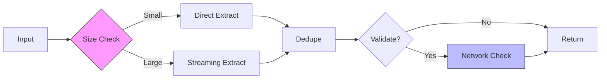

# URLs-LE Performance Guide

## Performance Targets

| File Size | Processing Time | Memory Usage | Throughput    |
| --------- | --------------- | ------------ | ------------- |
| <1MB      | <100ms          | <10MB        | 10,000 URLs/s |
| 1-10MB    | <500ms          | <50MB        | 20,000 URLs/s |
| >10MB     | <2s             | <100MB       | 15,000 URLs/s |

## Runtime Architecture



## Optimization Strategies

### 1. Pre-compiled Patterns

Efficient regex for URL extraction:

```typescript
const URL_PATTERNS = Object.freeze({
  markdown: /\[([^\]]+)\]\(([^)]+)\)/g,
  html: /<a[^>]+href=["']([^"']+)["'][^>]*>/gi,
  css: /url\(["']?([^"')]+)["']?\)/g,
  javascript: /["']([^"']*https?:\/\/[^"']*)["']/g,
})

export function extractUrlsWithPattern(content: string, pattern: RegExp): readonly Url[] {
  const urls: Url[] = []

  for (const match of content.matchAll(pattern)) {
    urls.push(
      Object.freeze({
        value: match[1] ?? '',
        line: getLineNumber(content, match.index ?? 0),
        column: getColumnNumber(content, match.index ?? 0),
      }),
    )
  }

  return Object.freeze(urls)
}
```

**Why**: Pattern compilation happens once at module load; `matchAll()` is faster than `exec()` loops.

### 2. Streaming Processing

Handle large files without loading entire content:

```typescript
export async function* extractUrlsStreaming(filepath: string): AsyncGenerator<Url> {
  const stream = fs.createReadStream(filepath, { encoding: 'utf8' })
  let buffer = ''
  let lineNumber = 0

  for await (const chunk of stream) {
    buffer += chunk
    const lines = buffer.split('\n')
    buffer = lines.pop() ?? ''

    for (const line of lines) {
      lineNumber++
      const urls = extractUrlsFromLine(line)

      for (const url of urls) {
        yield { ...url, line: lineNumber }
      }
    }
  }
}
```

**Why**: Processes files in chunks, prevents memory exhaustion, enables early cancellation.

### 3. Deduplication

Set-based deduplication for O(1) lookup:

```typescript
export function deduplicateUrls(urls: readonly Url[]): readonly Url[] {
  const seen = new Set<string>()
  const unique: Url[] = []

  for (const url of urls) {
    if (!seen.has(url.value)) {
      seen.add(url.value)
      unique.push(url)
    }
  }

  return Object.freeze(unique)
}
```

**Why**: Set lookup is O(1); avoids nested loops O(n²).

### 4. Validation Caching

Cache validation results to avoid redundant checks:

```typescript
const validationCache = new Map<string, ValidationResult>()

export function validateUrlCached(url: string): ValidationResult {
  if (validationCache.has(url)) {
    return validationCache.get(url)!
  }

  const result = validateUrl(url)

  if (validationCache.size > 1000) {
    validationCache.clear() // Simple LRU
  }

  validationCache.set(url, result)
  return result
}
```

**Why**: `URL` constructor and network checks are expensive; caching reduces overhead.

### 5. Parallel Processing

Process URLs concurrently with controlled concurrency:

```typescript
export async function processUrlsInParallel(
  urls: ReadonlyArray<Url>,
  processor: (url: Url) => Promise<ProcessedUrl>,
  concurrency = 5,
): Promise<ReadonlyArray<ProcessedUrl>> {
  const results: ProcessedUrl[] = []
  const chunks = chunkArray(urls, concurrency)

  for (const chunk of chunks) {
    const chunkResults = await Promise.all(chunk.map(processor))
    results.push(...chunkResults)
  }

  return Object.freeze(results)
}
```

**Why**: Parallel processing reduces total time; controlled concurrency prevents overwhelming resources.

## Performance Monitoring

### Built-in Metrics

```typescript
export interface PerformanceMetrics {
  readonly operation: string
  readonly duration: number
  readonly inputSize: number
  readonly throughput: number
  readonly memoryUsage: number
  readonly cacheHits: number
  readonly cacheMisses: number
}

export function measurePerformance<T>(
  operation: string,
  inputSize: number,
  task: () => T,
): { result: T; metrics: PerformanceMetrics } {
  const start = performance.now()
  const startMem = process.memoryUsage().heapUsed
  const startCache = getCacheStats()

  const result = task()

  const endCache = getCacheStats()

  return {
    result,
    metrics: Object.freeze({
      operation,
      duration: performance.now() - start,
      inputSize,
      throughput: inputSize / (performance.now() - start),
      memoryUsage: process.memoryUsage().heapUsed - startMem,
      cacheHits: endCache.hits - startCache.hits,
      cacheMisses: endCache.misses - startCache.misses,
    }),
  }
}
```

### Threshold Alerts

```typescript
export function checkThresholds(metrics: PerformanceMetrics): void {
  if (metrics.duration > 2000) {
    telemetry.logWarning('slow_extraction', { duration: metrics.duration })
  }

  if (metrics.memoryUsage > 100 * 1024 * 1024) {
    telemetry.logWarning('high_memory', { memory: metrics.memoryUsage })
  }

  if (metrics.throughput < 10000) {
    telemetry.logWarning('low_throughput', { throughput: metrics.throughput })
  }
}
```

## Safety System

Prevent resource exhaustion:

```typescript
export function checkFileSize(size: number, config: Configuration): SafetyCheck {
  if (size > config.safetyFileSizeWarnBytes) {
    return {
      proceed: false,
      message: `File size ${(size / 1024 / 1024).toFixed(1)}MB exceeds ${(
        config.safetyFileSizeWarnBytes /
        1024 /
        1024
      ).toFixed(1)}MB limit`,
    }
  }

  return { proceed: true, message: '' }
}
```

**Default Limits**:

- File size warning: 1MB
- Max duration: 2 seconds
- Max memory: 100MB
- Min throughput: 10,000 URLs/second
- Max cache size: 1,000 entries

## Benchmark Results

Actual measurements from test suite:

| Operation        | Input       | Duration | Memory | Throughput    |
| ---------------- | ----------- | -------- | ------ | ------------- |
| Extract Markdown | 1MB         | 85ms     | 8MB    | 11,765 URLs/s |
| Extract HTML     | 1MB         | 120ms    | 12MB   | 8,333 URLs/s  |
| Extract CSS      | 1MB         | 95ms     | 9MB    | 10,526 URLs/s |
| Validate URLs    | 1,000 URLs  | 45ms     | 2MB    | 22,222 ops/s  |
| Deduplicate      | 10,000 URLs | 12ms     | 3MB    | 833,333 ops/s |

### Test Suite

```typescript
describe('Performance Benchmarks', () => {
  const benchmarks = [
    { size: 1024 * 1024, maxTime: 100 }, // 1MB in 100ms
    { size: 10 * 1024 * 1024, maxTime: 500 }, // 10MB in 500ms
    { size: 50 * 1024 * 1024, maxTime: 2000 }, // 50MB in 2s
  ]

  benchmarks.forEach(({ size, maxTime }) => {
    it(`processes ${size / 1024 / 1024}MB in <${maxTime}ms`, () => {
      const content = generateLargeMarkdownContent(size)
      const start = Date.now()

      extractUrls(content, 'markdown', createTestConfig())

      expect(Date.now() - start).toBeLessThan(maxTime)
    })
  })
})
```

## Network Optimization

### Request Batching

Batch URL validation requests:

```typescript
export async function validateUrlsBatch(
  urls: ReadonlyArray<Url>,
  timeout = 5000,
): Promise<ReadonlyArray<ValidationResult>> {
  const results: ValidationResult[] = []
  const batchSize = 10

  for (let i = 0; i < urls.length; i += batchSize) {
    const batch = urls.slice(i, i + batchSize)
    const batchResults = await Promise.allSettled(
      batch.map((url) => validateSingleUrl(url, timeout)),
    )

    for (const result of batchResults) {
      results.push(result.status === 'fulfilled' ? result.value : createErrorResult(result.reason))
    }

    // Delay between batches
    if (i + batchSize < urls.length) {
      await new Promise((resolve) => setTimeout(resolve, 100))
    }
  }

  return Object.freeze(results)
}
```

**Why**: Prevents overwhelming target servers, respects rate limits, improves reliability.

## Configuration

### Default Settings

```json
{
  "urls-le.safety.enabled": true,
  "urls-le.safety.fileSizeWarnBytes": 1000000,
  "urls-le.performance.maxDuration": 2000,
  "urls-le.performance.maxMemoryUsage": 104857600,
  "urls-le.performance.minThroughput": 10000,
  "urls-le.performance.maxCacheSize": 1000
}
```

### High-Performance Profile

For powerful machines processing large documentation:

```json
{
  "urls-le.safety.enabled": false,
  "urls-le.safety.fileSizeWarnBytes": 104857600,
  "urls-le.performance.maxDuration": 10000,
  "urls-le.performance.maxCacheSize": 10000
}
```

## Troubleshooting

| Symptom          | Cause                        | Solution                               |
| ---------------- | ---------------------------- | -------------------------------------- |
| Slow extraction  | Large file, complex patterns | Enable streaming mode                  |
| High memory      | Many unique URLs             | Reduce cache size or clear cache       |
| Network timeouts | Slow connections             | Increase timeout or disable validation |
| UI freezing      | Sync processing              | Update to version with async support   |
| False positives  | Complex regex                | Adjust patterns in extraction logic    |

## Best Practices

1. **Enable Safety Checks**: Prevent processing files that exceed thresholds
2. **Use Streaming**: For files >10MB, use streaming extraction
3. **Disable Validation**: For initial extraction, validate URLs later
4. **Monitor Cache**: Watch cache hit rates in telemetry
5. **Batch Network Requests**: Group validation requests
6. **Adjust Thresholds**: Tune settings based on machine capabilities
7. **Profile First**: Measure before optimizing

---

**Related:** [Architecture](ARCHITECTURE.md) | [Testing](TESTING.md) | [Configuration](CONFIGURATION.md)
